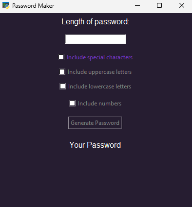

# python-password

This is a simple application built mainly in Python, with a Tkinter interface. There are many things to fix and improve. It was built as a didactic exercise, and there is room for improvement in the process and presentation of the results.

I learned how to use the Tkinter library to create a simple Graphical User Interface, making the program more appealing and user-friendly.

## Installation

I tried to keep the app's dependencies to a minimum, but I used pyperclip to copy the password to the clipboard. To install these dependencies, use the following command:


 ```pip install -r requirements.txt```

This command will take care of the necessary dependencies.

### Scrennshot

The app features a simple interface with checkboxes to select the different properties you want in your password.



Additionally, there's a small functionality to copy the password directly into your clipboard.


### TO-DO
    - Work on improving the way error messages are displayed.
    - Improve the application's functionality.
    - Make the application more modular and use Object-Oriented Programming principles.
